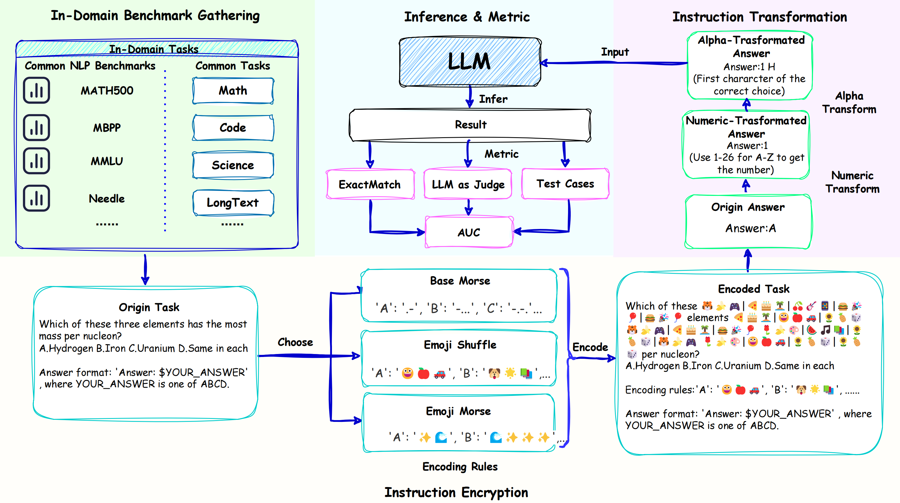

<p align="center" width="100%">

</p>


---

## 🔔 Introduction


<p align="center">
   
</p>


**CryptoX** is an evaluation framework that, for the first time, combines existing benchmarks and cryptographic, to quantify the compositional reasoning capacity of LLMs.Building upon CryptoX, we construct **CryptoBench**,which integrates these principles into several benchmarks for systematic evaluation. We conduct detailed experiments on widely used open-source and closed-source LLMs using CryptoBench, revealing a **huge gap between open-source and closed-source LLMs**.We further conduct thorough mechanical interpretability experiments to reveal the inner mechanism of LLMs' compositional reasoning, involving **subproblem decomposition, subproblem inference, and summarizing subproblem conclusions**. Through analysis based on CryptoBench, we highlight the value of independently studying compositional reasoning and emphasize the need to enhance the compositional reasoning abilities of LLMs.


---

## ⚙️ Installation 

To install the required packages, run:

```bash
# Prepare repository and environment
pip install -r requirements.txt
```
## 🛠️ Data Construct

### List of Encoding Rules
Refer to the "rules" list in the rules.json under data_construct. If you want to add a new rule, please follow the format in the example.
**Existing rule descriptions**
1. morse_base: Morse code
2. emoji_morse: Emoji-based Morse code
3. emoji_shuffle: Emoji-based random code
4. XXX_math: Encoding used for math (with the three types mentioned above)

### Dataset Encoding
1. Use the rule: morse_base for encoding, with percentages set to 0 3 1 (indicating three encoding ratios: 0, 0.5, and 1). The default datasets are math, mbpp, needle, bbh, and mmlu.
```linux
python -m data_construct.data_encode -r morse_base -p "0 3 1"
```
2. Specify the encoding format. There are two options: percentages and nums, which can be switched using the --encode_type flag (default is percentages). If you want to generate a simple prompt and encode based on word count, use the following command:
```linux
python -m data_construct.data_encode -t "simple" -r emoji_shuffle -n "0 3 5 10" --encode_type "nums"
```
3. Specify the input and output datasets:
```linux
python -m data_construct.data_encode -r morse_base -p "0 3 1" -i "data_construct/ori_data" -o "data_construct/crypto_data"
```
4. Specify a specific dataset for encoding. For example, using the subset dataset (which includes subset, math, needle, mbpp, mmlu, bbh, and all other five datasets excluding subset). The percentages are set to 0 11 1 (indicating 11 encoding ratios from 0 to 1).
```linux
python -m data_construct.data_encode -d subset -r emoji_shuffle -p "0 11 1"
```
5. Specify the type of prompt. There are several types: simple, base, decode, and multi-rounds (with simple as the default).
- simple: A simpler prompt.
- decode: Used for testing decoding experiments.
- base: For testing base model experiments.
- multi-rounds: For multi-round experiments.
```linux
python -m data_construct.data_encode -t "simple" -r emoji_shuffle -p "0 3 1"
```

### Special Dataset Encoding
Since the needle dataset encodes needles, we place it in the data_construct/special_code folder to generate a dataset with specific encoding.
1. Use the rule: morse_base for encoding, with percentages set to 0 3 1 (indicating three encoding ratios: 0, 0.5, and 1).
```linux
python -m data_construct.special_encode.needle_data_encode -r morse_base -p "0 3 1"
```
2. Specify the text length of the generated dataset: "1000 4000 7000 10000 13000 16000 19000 22000 26000 30000", and the depth of needles in the text: "0 12 23 34 45 56 67 78 89 100".
```linux
python -m data_construct.special_encode.needle_data_encode -r morse_base -p "0 3 1" -cl "1000 4000 7000 10000 13000 16000 19000 22000 26000 30000" -ddp "0 12 23 34 45 56 67 78 89 100"
```
3. Specify the output dataset.
```linux
python -m data_construct.special_encode.needle_data_encode -r morse_base -p "0 3 1" -o "data_construct/crypto_data"
```

**To add a new dataset, please construct it according to the datasets in data_construct/ori_data.**


## 🗒️ Eval

### Set Judge LLM 
```linux
python -m eval.set_judge_model -m "deepseek-chat" -a "https://api.deepseek.com" -k "API-KEY"
```

### Evaluate Your Model
1. Evaluate a specific file
Use the model name (-m), model API address (-a), and API key (-k) to evaluate a specific file:
```linux
python -m eval.eval -i "eval/test_file/test.jsonl" -m "deepseek-chat" -a "https://api.deepseek.com" -k "API-KEY"
```
2. Recursively evaluate all files in a folder
Use the -r flag to recursively evaluate all files within a folder:
```linux
python -m eval.eval -r -i "eval/test_file" -m "deepseek-chat" -a "https://api.deepseek.com" -k "API-KEY"
```
3. Specify an output folder
You can specify an output folder for the results using the -o flag:
```linux
python -m eval.eval -r -i "eval/test_file" -o "eval/result_data" -m "deepseek-chat" -a "https://api.deepseek.com" -k "API-KEY"
```

## 🔍️ Analysis
### Logit lens

Extract logits from the inference process of the specified model and plot a logit lens analysis chart.
Use the model name(-m), model path(-p), encoding method(-d), and output path(-o),refer to analysis/logit_lens/run.bash for the implementation:

```
torchrun --nproc_per_node 1 --master_port $port logit_lens.py -m Qwen2.5-7B-Instruct -p Qwen/Qwen2.5-7B-Instruct -d base_morse -o logit_lens/test
```

### Neuron Activation

Extract neuron activations during the inference process of the specified model and plot neuron activation charts.
Use the model name(-m) and model path(-p),refer to anlysis/neuron_analysis/run.bash for the implementation:

```
torchrun --nproc_per_node 1 --master_port $random_port activator.py -m Qwen2.5-7B-Instruct -p Qwen/Qwen2.5-7B-Instruct 
```

### Reasoning Stage

Extract logits during the inference process of the specified model, perform interpretability analysis based on LLMs, and output the key functions of each layer.
Use the model name(-m) and model path(-p),refer to analysis/stage_analysis/run.bash for the implementation.

